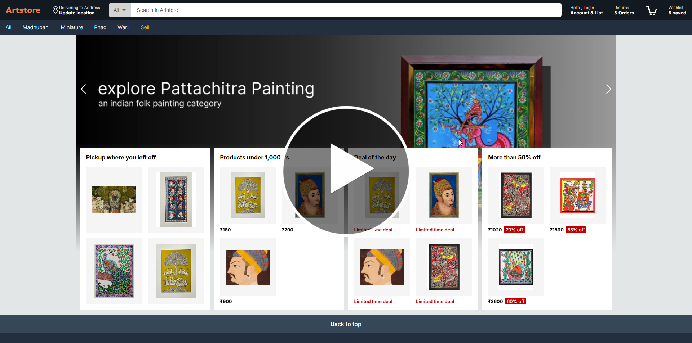

# 🎨 Artstore Frontend

**Artstore** is a modern e-commerce web application where art enthusiasts can explore, buy, and sell artworks.  
This repository contains the **frontend** codebase of the Artstore buyer platform.

---

## 🚀 Live Preview

🔗 **Live Website**  
👉 https://artstoreonline.vercel.app

🎥 **Demo Video (YouTube Walkthrough)**  
Click the preview image below to watch the full demo 👇

[](https://youtu.be/5V2oyHMr7VU)

> The video demonstrates browsing artworks, cart flow, wishlist, authentication, and checkout experience.

---

## ✨ Key Features & Integrations

- **Payment Gateway:** Integrated with **Razorpay** for secure and seamless online transactions.  
- **State Management:** Efficient global state management using **React Context API** with reducers.  
- **Routing:** Declarative navigation powered by **React Router**.  
- **Responsive Design:** Fully optimized for desktops, tablets, and mobile devices.  
- **User Authentication:** Secure user registration, login, and profile management.  
- **Address Management:** Support for multiple addresses with autofill from location feature.  
- **Product Catalog:** Browse, search, and filter artworks effortlessly.  
- **Shopping Cart & Wishlist:** Manage cart items, checkout seamlessly, and save favorites in multiple wishlists.  
- **Rating & Reviews:** Create, edit, and view reviews for products.  
- **Orders Management:** Track the history of all completed orders with ease.  
- **Recently Viewed & Recommended Artworks:** View recently browsed items and receive personalized recommendations.

## 📂 Folder Structure

The project follows a clean and scalable React architecture:

```txt
src/
├── actions/        # Actions for Context/Reducer state management
├── components/     # Reusable UI components
├── configs/        # App-level configuration (e.g., IndexedDB)
├── context/        # React Context providers
├── data/           # Static data (filters, categories, etc.)
├── hooks/          # Custom React hooks
├── images/         # Static image assets
├── pages/          # Page-level components (Home, Cart, Account, etc.)
├── reducers/       # Reducers for state transitions
├── services/       # API service calls
├── utils/          # Helper and utility functions
└── App.js / index.js / Router.js
```


## 📚 API Documentation

Explore the API endpoints used by Artstore:
- **Postman Docs:** [https://documenter.getpostman.com/view/19675500/2sBXVbGZAs](https://documenter.getpostman.com/view/19675500/2sBXVbGZAs)

## 🛠️ Tech Stack Used

*   **Frontend:** React.js
*   **Backend:** Express, Node.js (Separate repository)
*   **Database:** MongoDB (Separate repository)


